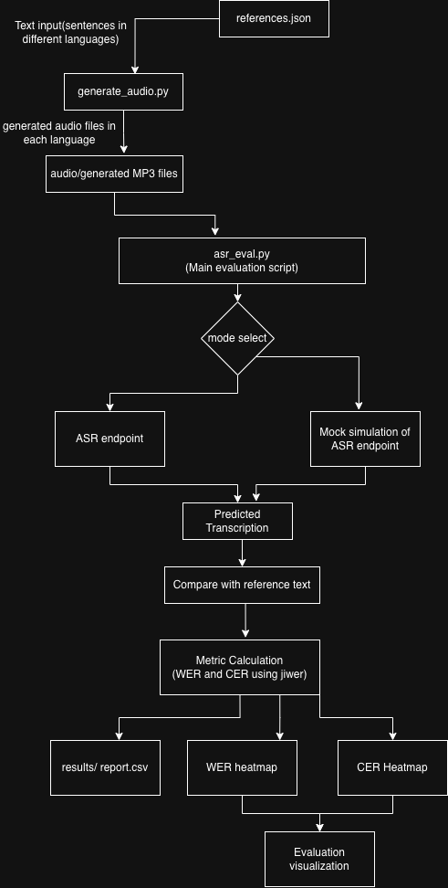
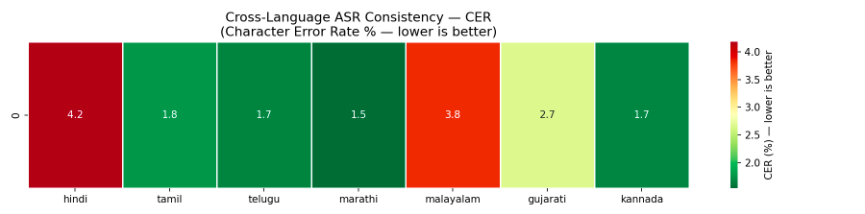

# indic-asr-eval

A cross-language ASR evaluation tool that benchmarks speech recognition consistency across Indic languages, computing WER (Word Error Rate) and CER (Character Error Rate) metrics with heatmap visualizations.

Built as a contribution to the [AI4I Core](https://github.com/COSS-India/ai4i-core) platform — an open-source platform for Indic language AI services.

---

## What is this?

AI4I Core provides ASR (Automatic Speech Recognition) for Indian languages. But how consistently does it perform across languages? Does it work equally well for all languages?

This tool answers that question by:
1. Taking audio samples in multiple Indic languages
2. Sending them to the ASR inference endpoint
3. Comparing transcriptions against reference text
4. Calculating WER and CER per language
5. Generating heatmaps and a CSV report

---

## Architecture


## Tech Stack

| Tool | Purpose |
|---|---|
| Python 3.11 | Core language |
| gTTS | Text-to-speech audio generation |
| pydub | MP3 to float array conversion |
| ffmpeg | Audio processing (required by pydub) |
| jiwer | WER and CER calculation |
| numpy | Audio signal processing |
| pandas | Results table |
| seaborn + matplotlib | Heatmap generation |
| requests | HTTP calls to ASR endpoint |

---
## Supported Languages

| Language | Code |
|---|---|
| Hindi | hi |
| Tamil | ta |
| Telugu | te |
| Marathi | mr |
| Malayalam | ml |
| Gujarati | gu |
| Kannada | kn |

---
## Project Structure
indic-asr-eval/
├── audio/                    ← Generated MP3 files (language_sentenceID.mp3)
├── references/
│   └── references.json       ← Test dataset (10 sentences × 7 languages)
├── results/
│   ├── report.csv            ← WER + CER scores
│   ├── wer_heatmap.png       ← WER heatmap
│   └── cer_heatmap.png       ← CER heatmap
├── asr_eval.py               ← Main evaluation script
├── generate_audio.py         ← Audio generation script
├── requirements.txt          ← Python dependencies
├── ADDING_LANGUAGES.md       ← Guide for adding new languages
└── README.md

___

## Dataset — references.json

The `references/references.json` file contains the test dataset used for evaluation. It has **10 everyday sentences** translated into all 7 supported languages. These sentences were chosen to reflect practical, real-world usage of the AI4I platform.

You can use the existing dataset as-is, or create your own custom dataset with your own sentences and languages.

See [ADDING_LANGUAGES.md](./ADDING_LANGUAGES.md) for a step-by-step guide on how to:
- Add new sentences to the dataset
- Add new languages
- Generate your own audio files using gTTS
- Run evaluation on your custom dataset

---

## Prerequisites

Make sure you have the following installed before starting:

**1. Python 3.11**
- Download from [python.org](https://www.python.org/downloads/)
- Verify: `python3.11 --version`

**2. ffmpeg**
```bash
# Mac
brew install ffmpeg

# Ubuntu/Linux
sudo apt install ffmpeg -y

# Windows
# Download from https://ffmpeg.org/download.html and add to PATH
```

**3. Git**
- Download from [git-scm.com](https://git-scm.com)
- Verify: `git --version`

**4. ASR Endpoint Access**
- You need access to an AI4I inference server running Triton
- The endpoint format is: `http://<server-ip>:5000/v2/models/asr_am_ensemble/infer`
- If you don't have access, use [Mock Mode](#running-in-mock-mode)

---
## Setup

**Step 1 — Clone the repo:**
```bash
git clone https://github.com/yourusername/indic-asr-eval.git
cd indic-asr-eval
```

**Step 2 — Create a virtual environment:**
```bash
# Mac/Linux
python3.11 -m venv venv
source venv/bin/activate

# Windows
python3.11 -m venv venv
venv\Scripts\activate
```

**Step 3 — Install dependencies:**
```bash
pip install -r requirements.txt
```

**Step 4 — Generate audio files:**
```bash
python3 generate_audio.py
```
This creates 70 MP3 files in the `audio/` folder (10 sentences × 7 languages).

**Step 5 — Configure the ASR endpoint:**

Open `asr_eval.py` and update:
```python
ASR_ENDPOINT = "http://<your-server-ip>:5000/v2/models/asr_am_ensemble/infer"
USE_MOCK = False  # Set to True if you don't have endpoint access
```

**Step 6 — Run the evaluation:**
```bash
python3 asr_eval.py
```

---

## Running in Mock Mode

If you don't have access to the ASR endpoint, run the tool in mock mode which simulates ASR responses and demonstrates the full pipeline:

Note: run all the steps except Step 5 as mentioned above in the Setup.

```python
# In asr_eval.py
USE_MOCK = True
```

Then run:
```bash
python3 asr_eval.py
```

Mock mode reads the real audio files but simulates transcription errors so you can see the full output without needing the endpoint.

---
## Output

### Terminal
The terminal output should look something like this:


### WER Heatmap


### CER Heatmap


### results/report.csv


---

## Troubleshooting

### `ModuleNotFoundError: No module named 'pydub'`
```bash
pip install pydub
```

### `FileNotFoundError: ffprobe not found`
ffmpeg is not installed or not in PATH.
```bash
# Mac
brew install ffmpeg

# Linux
sudo apt install ffmpeg -y
```

### `Connection refused` on ASR endpoint
- Check the server IP and port are correct
- Verify the Triton inference server is running
- Check your network can reach the server
- Test connectivity: `curl http://<server-ip>:5000/v2/health/ready`

### `KeyError: 'outputs'` from ASR response
The model name might be wrong. Check available models:
```bash
curl http://<server-ip>:5000/v2/models
```

### `FileNotFoundError: audio/<lang>_<id>.mp3`
Audio files not generated yet. Run:
```bash
python3 generate_audio.py
```

### `ModuleNotFoundError: No module named 'audioop'`
You are using Python 3.13 which removed the `audioop` module. Switch to Python 3.11:
```bash
python3.11 -m venv venv
source venv/bin/activate
pip install -r requirements.txt
```

### WER is 0% for all languages in mock mode
This is expected if no errors were randomly introduced. Run again — mock mode uses random error rates so results vary each run.

---

## Cost Breakdown

| Resource | Cost |
|---|---|
| Python, all pip libraries | Free |
| ffmpeg | Free |
| gTTS audio generation (70 files) | Free |
| ASR endpoint (AI4I Triton server) | Provided by AI4I team |

**Running this tool locally is completely free** as long as you have access to the ASR endpoint.

---

## Limitations

### Language Coverage

This tool currently supports 7 Indic languages for audio generation using [gTTS (Google Text-to-Speech)](https://gtts.readthedocs.io/). 

For languages like Garo, Khasi, Bodo, Mizo, and Tulu — gTTS does not provide support. However, the AI4I platform itself has TTS capabilities for a wider range of Indic languages. Ideally, the AI4I TTS endpoint would be used to generate audio for these languages, which would make this evaluation tool fully self-contained within the AI4I ecosystem.

Currently this is not possible due to a setup and  configuration issue that prevents access to the TTS inference endpoint in the local setup. Once that is resolved, the audio generation script can be updated to use the AI4I TTS endpoint instead of gTTS, extending coverage to minority and tribal languages.

In the meantime, alternative options include:
- [IndicVoices-R](https://github.com/AI4Bharat/IndicVoices-R) — real human recordings for Bodo, Santali, Manipuri (access required)
- Native speaker recordings for truly unsupported languages like Garo and Khasi

See [ADDING_LANGUAGES.md](./ADDING_LANGUAGES.md) for more details on how to extend language coverage.